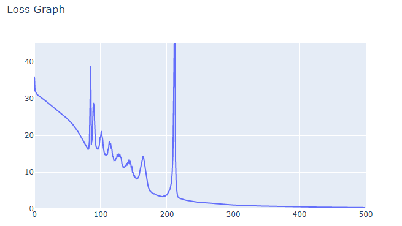

# MiniTorch Module 1

* Docs: https://minitorch.github.io/

* Overview: https://minitorch.github.io/module1.html

This assignment requires the following files from the previous assignments.

        minitorch/operators.py 
        minitorch/module.py 
        
        X tests/test_module.py 
        X tests/test_operators.py 
        project/run_manual.py

## HW1_5

> Train a scalar model for each of the 4 main datasets.
>
> Add the output training logs and final images to your README file.

### Dataset01: Simple

> Hidden layer: 2
>
> Learning Rate: 0.5
>
> Number of epochs: 500

### Dataset02: Diag

> Hidden layer: 8
>
> Learning Rate: 0.5
>
> Number of epochs: 1000

### Dataset03： Split

> Hidden layer: 8
>
> Learning Rate: 0.5
>
> Number of epochs: 500

### Dataset03: Xor

> Hidden layer: 8
>
> Learning Rate: 0.5
>
> Number of epochs: 500

#### 150点

> Hidden layer: 10
>
> Learning Rate: 0.5
>
> Number of epochs: 1000

